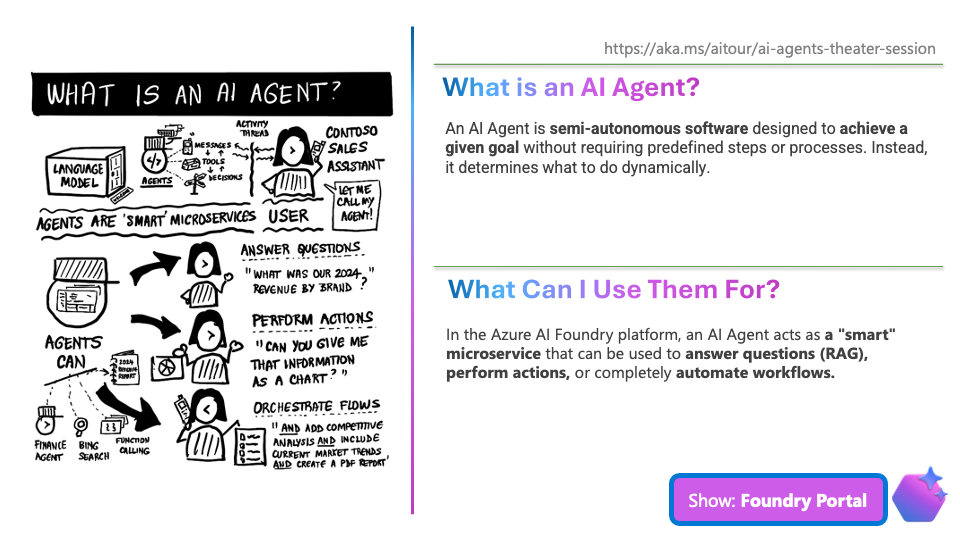
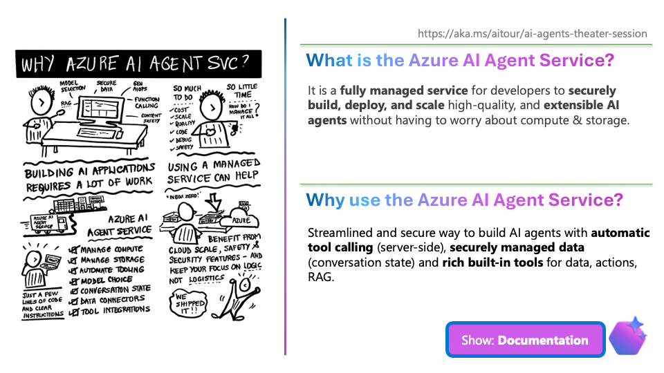

# 1.1 AI Agent Service (1 min)

!!! quote "AI AGENT - 30 SECONDS"

    - An AI Agent is a semi-autonomous entity 
    designed to achieve a specific goal
    by taking actions dynamically
    - Think of it as a SMART MICROSERVICE

!!! quote "AI AGENT - 30 SECONDS"

    - The Azure AI Agent Service is a MANAGED SERVICE
    for creating, deploying, and scaling AI agents.
    - It lets us focus on app LOGIC not the LOGISTICS!

