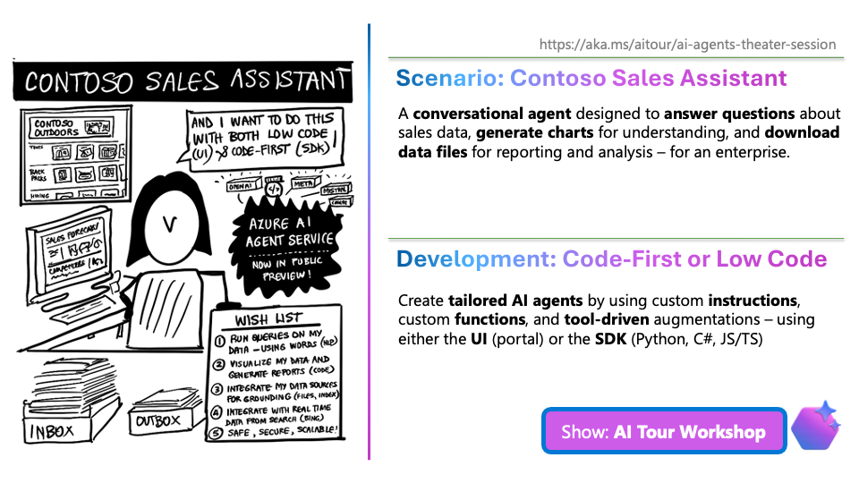

# 2.1 Imagine Scenario (1 min)

!!! quote "IMAGINE A SCENARIO - 30 seconds"

    - You work for a popular retail enterprise in a competitive market.
    - You are asked to build an agent that "chats with sales data"
    - It should ANSWER questions, GENERATE charts, and ADD REAL-TIME insights from the web

