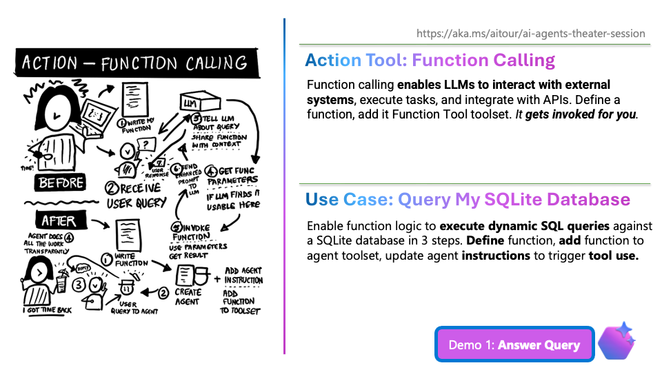

# 4.1 Function Calling (2 min)

!!! tip "NO NEED TO SHOW THE SLIDE. Stay in Codespaces and just "speak" to the demo using the context."

!!! quote "DEMO: Function Calling - 2 min"

    - (Uncomment instruction 1 and run the agent)
    - ASK QUESTION: `What are the sales by region`
    - SHOW INSTRUCTION:
        ```txt title="Tools Section"
        1. Sales Data Assistance

        - Use the Contoso sales database as defined by the schema: {database_schema_string}.
        - All queries use the fetch_sales_data_using_sqlite_query function.
        - Provide aggregated results by default, unless the user explicitly requests detail.
        - Limit all query results to a maximum of 30 rows.
        - Never generate a query that returns all rows, ask the user to be more specific about the data they want.
        - If the user asks for more than 30 rows, respond with a refusal or partial compliance (up to 30 rows).
        - Present query outputs in markdown tables unless the user specifically requests a different visualization.
        ```

    - EXPLAIN: 
        - You just saw the Function Calling tool in action
        - It automatically called the function _without my orchestrating the process_!



