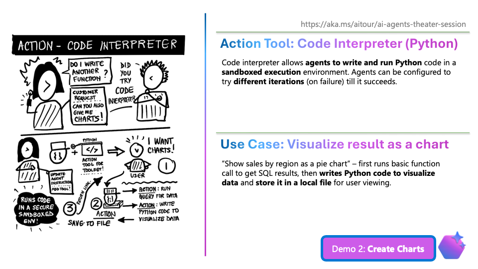

# 4.2 Code Interpreter (2 min)

!!! tip "NO NEED TO SHOW THE SLIDE. Stay in Codespaces and just "speak" to the demo using the context."

!!! quote "DEMO: Code Interpreter - 2 min"

    - (Uncomment instruction 2 and run the agent)
    - ASK QUESTION: `Show sales by region as a pie chart`
    - SHOW INSTRUCTION:
        ```txt title="Tools Section"
        2. Visualization and Code Interpretation

        - Test and display visualization code using the code interpreter, retrying if errors occur.
        - Always use charts or graphs to illustrate trends when requested.
        - Always create visualizations as `.png` files.
        - Always include the file_path_annotation.
        - Adapt visualizations (e.g., labels) to the user's language preferences.
        - When asked to download data, default to a `.csv` format file and use the most recent data.
        ```

    - EXPLAIN: 
        - You just saw the Code Interpreter tool in action
        - It created chart and saved it to a file! (I don't have to know how to code this!)



