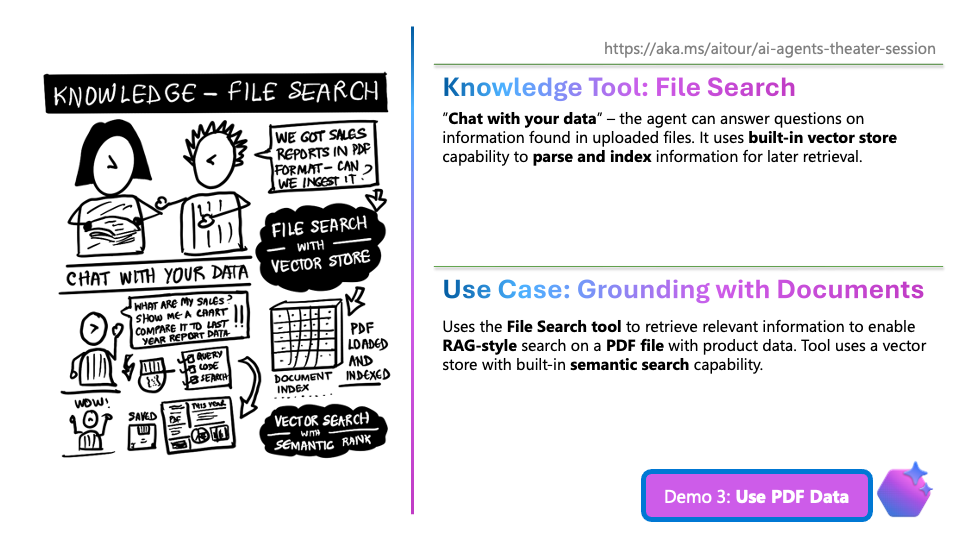

# 3.2 Use File Search (2 min)


!!! tip "NO NEED TO SHOW THE SLIDE. Stay in Codespaces and just "speak" to the demo using the context."

!!! quote "DEMO: Grounding with File Search - 2 min"

    - (Uncomment instruction 3 and run the agent)
    - ASK: What brands of hiking shoes do we sell?  => No answer in PDF ❌
    - ASK: What brands of tents do we sell? => Answer from PDF ✅

    - SHOW INSTRUCTION:
        ```txt title="Tools Section"
        2. Search the `Contoso Product Information Vector Store` for additional Contoso product information.
        ```

    - EXPLAIN: 
        - File Search tool uses built-in Vector Store capability
        - You saw file ingested, data extracted, and index created - to return search results


