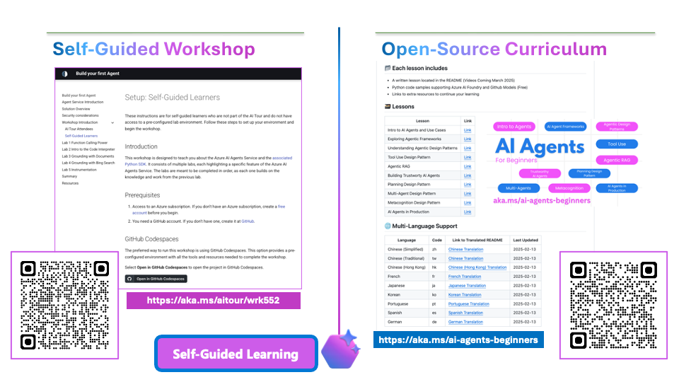

# 5. Let's Recap! (1 min)

!!! tip "RETURN TO SLIDES. If time is short, show this slide only and encourage them to take/share a photo"

!!! quote "4 THINGS TO TAKE AWAY"

    - Azure AI Agent Service is a MANAGED service in Azure AI Foundry
    - Azure AI Agents are SMART MICROSERVICES that can retrieve knowledge and take action
    - ACTION TOOLS like Function Calling and Code Interpreter streamline task automation
    - KNOWLEDGE TOOLS like File Search and Bing Search help ground responses in relevant data
    

---

!!! tip "IF TIME PERMITS. Show this slide for continued learning!"

